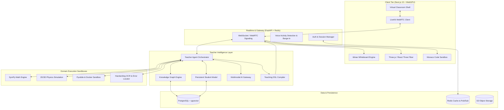

<div align="center">

# 🎓 MENTORA
### The AI Teacher That Doesn't Just Answer. It Teaches.

**Adaptive Multimodal Virtual Classroom for Personalized, Interactive Learning**

[](LICENSE)
[](https://nextjs.org/)
[](https://www.typescriptlang.org/)
[](https://fastapi.tiangolo.com/)
[](https://threejs.org/)
[](https://livekit.io/)
[](https://python.org)

<br />

> **"AI should not only know the answer. AI should know how to teach the student."**  
> *ChatGPT answers. Mentora teaches.*

</div>

---

## 🌟 Overview

**Mentora** is a production-grade, multimodal AI teaching platform designed to transform how humans learn with artificial intelligence. 

Instead of functioning as a passive chatbot that generates text answers, Mentora places students into a **live virtual classroom** led by an autonomous AI teacher capable of:

$$\mathbf{See \longrightarrow Listen \longrightarrow Understand \longrightarrow Teach \longrightarrow Demonstrate \longrightarrow Ask \longrightarrow Evaluate \longrightarrow Adapt}$$

When a student says *"I don't understand derivatives,"* Mentora doesn't output an essay. It initiates an interactive teaching session: it inspects prerequisite concepts, sketches tangent lines on an interactive whiteboard, runs dynamic animations, asks formative questions, analyzes the student's digital handwriting, and dynamically adapts its pedagogical strategy until genuine mastery is achieved.

### 🚀 100% Dynamic On-The-Fly Teaching (Zero Preloaded Fixtures)
Mentora does not use static preloaded lessons or fixed video scripts. Every lesson, timeline cue, whiteboard entity, and Socratic evaluation is dynamically synthesized in real-time by the AI Teacher Agent using the Teaching DSL and Corbett-Anderson Bayesian Knowledge Tracing.

---

## ⚡ The Paradigm Shift

Traditional conversational AI models follow an answer-oriented model:

```text
Student Question ──▶ Large Language Model ──▶ Static Text Answer
```

### Why Chatbots Fail at Teaching
- ❌ **No Concept Diagnostics:** Never verifies if the student is missing prerequisite knowledge (e.g., trying to explain derivatives when the student does not understand limits).
- ❌ **Passive Consumption:** Dumps walls of text without checking if the student is actively following.
- ❌ **Single-Modal Delivery:** Explanations rely on text rather than visual proofs, interactive 3D simulations, or live handwriting.
- ❌ **Blind to Student Work:** Cannot observe handwritten scratchpads or step-by-step algebraic derivations to pinpoint misconceptions.
- ❌ **No Strategy Adaptation:** Cannot switch from high-level intuition to Socratic questioning or counterexamples when a student gets stuck.

### The Mentora Closed-Loop Model
```text
                       STUDENT
                          │
                   Voice / Ink / Code
                          ▼
                  ┌───────────────┐
                  │ Understand &  │
                  │ Diagnose Gap  │
                  └───────┬───────┘
                          ▼
                  ┌───────────────┐
                  │ Plan Strategy │◀────────────┐
                  └───────┬───────┘             │
                          ▼                     │
                  ┌───────────────┐             │ (Pedagogical
                  │     TEACH     │             │  Loop)
                  │ Speech + Board│             │
                  │ + 3D Sim      │             │
                  └───────┬───────┘             │
                          ▼                     │
                  ┌───────────────┐             │
                  │ Formative Q   │             │
                  │ or Challenge  │             │
                  └───────┬───────┘             │
                          ▼                     │
                  ┌───────────────┐             │
                  │ Evaluate Ink, │             │
                  │ Voice, Code   │             │
                  └───────┬───────┘             │
                          ▼                     │
                  ┌───────────────┐             │
                  │ Adapt Lesson  ├─────────────┘
                  └───────┬───────┘
                          │ (Mastery Achieved)
                          ▼
                   Advance Topic
```

---

## 🏛️ The Virtual Classroom

Mentora replaces the chat prompt with a unified, synchronized virtual classroom interface:

```text
┌──────────────────────────────────────────────────────────────────────────┐
│                             MENTORA CLASSROOM                            │
├─────────────────────────────────────────────┬────────────────────────────┤
│                                             │                            │
│           INTERACTIVE MULTIMODAL BOARD      │         AI TEACHER         │
│                                             │                            │
│   • Mathematical Equations (KaTeX / MathLive) │      [ Animated Avatar ]   │
│   • Dynamic Coordinate Graphs & Geometry    │                            │
│   • 3D Interactive WebGPU Models (R3F)      │      • Live Voice Stream   │
│   • Physics & Engineering Simulations       │      • Pedagogical State   │
│   • Sandboxed Code Editor (Monaco)          │      • Concept Trajectory  │
│   • Stroke-Level Student Ink Canvas         │      • Socratic Guidance   │
│                                             │                            │
├─────────────────────────────────────────────┴────────────────────────────┤
│   🎙️ Speak naturally...   ✍️ Draw on board   💻 Run code   ⌨️ Type message   │
└──────────────────────────────────────────────────────────────────────────┘
```

The AI teacher orchestrates the classroom in real time:
- **Speaks** with natural, low-latency conversational audio.
- **Draws and writes** step-by-step proofs on the canvas.
- **Manipulates 3D objects** (rotates angles, zooms in on molecular bonds or mechanical assemblies).
- **Inspects handwritten work**, highlighting the exact line where a student made a sign error.
- **Executes code** in an isolated sandbox, visually stepping through variables and call stacks.

---

## 🎯 8 Adaptive Pedagogical Modes

The Teacher Agent continuously switches teaching strategies based on student understanding:

| Mode | Strategy | Classroom Interaction |
| :--- | :--- | :--- |
| **1. Explanation** | Structured step-by-step breakdown | Synchronized speech and whiteboard diagramming |
| **2. Socratic** | Probing questions to guide discovery | Teacher asks diagnostic questions; student responds |
| **3. Visual / 3D** | Geometric & spatial intuition | WebGPU coordinate sweeps, vector field rotations |
| **4. Demonstration** | Live parameter-driven experiment | Physics sandbox (e.g., doubling velocity to observe trajectory) |
| **5. Worked Example** | Collaborative problem solving | Teacher solves step 1 $\rightarrow$ Student solves step 2 |
| **6. Guided Practice** | Student-led work with scaffolding | Student writes solution; teacher provides subtle hints |
| **7. Debugging** | Misconception isolation | Pinpointing errors in student's code trace or algebra |
| **8. Assessment** | Unassisted verification | Checking concept mastery before progressing |

---

## 📜 The Teaching DSL (Domain Specific Language)

Mentora decouples high-level pedagogical reasoning from UI rendering through a declarative **Teaching DSL**. This guarantees deterministic, synchronized execution across audio, whiteboard, and 3D scenes.

```json
{
  "sessionId": "sess_98241",
  "turnId": "turn_04",
  "pedagogicalState": {
    "concept": "calculus/derivative_tangent_slope",
    "strategy": "socratic_visual",
    "masteryScore": 0.65
  },
  "speech": {
    "text": "Notice how the secant line steepens as point Q approaches point P. What happens to delta x as these two points touch?",
    "timingMarkers": [
      { "word": "secant", "timestampMs": 420 },
      { "word": "touches", "timestampMs": 2850 }
    ]
  },
  "actions": [
    {
      "target": "whiteboard",
      "operation": "animate_tangent",
      "payload": {
        "function": "f(x) = x^2",
        "fixedPoint": { "x": 1, "y": 1 },
        "sweepDeltaX": { "from": 2.0, "to": 0.01 },
        "durationMs": 3000
      }
    },
    {
      "target": "whiteboard",
      "operation": "highlight_formula",
      "payload": {
        "latex": "\\lim_{\\Delta x \\to 0} \\frac{f(x+\\Delta x) - f(x)}{\\Delta x}",
        "color": "#7C3AED"
      }
    },
    {
      "target": "assessment",
      "operation": "expect_student_input",
      "payload": {
        "inputModes": ["voice", "handwriting"],
        "expectedConcept": "delta_x_approaches_zero"
      }
    }
  ]
}
```

---

## 🧠 System Architecture



---

## 🔬 Multi-Domain Capabilities

```text
                                MENTORA
                                   │
                             TEACHER CORE
                                   │
         ┌─────────────────┬───────┴─────────┬─────────────────┐
         ▼                 ▼                 ▼                 ▼
    MATHEMATICS         PHYSICS       COMPUTER SCIENCE     SCIENCES
         │                 │                 │                 │
  • Symbolic SymPy  • WebGPU 3D       • Monaco Sandbox  • MolStar PDB
  • LaTeX MathLive  • Vector Fields   • Step Debugger   • 3D Anatomy
  • Animated Curves • Trajectory Sim  • AST Visualizer  • Reaction Rates
```

- **📐 Mathematics:** Symbolic calculus, step-by-step algebraic manipulation, dynamic coordinate graphs, and limits.
- **⚛️ Physics:** Projectile motion, electromagnetic fields, optics, orbital mechanics with live variable sliders.
- **💻 Computer Science:** Algorithm visualizations (e.g. binary search trees, sorting animations, recursion stacks, memory pointers).
- **🧬 Biology & Chemistry:** Interactive 3D molecular structures (PDB), DNA transcription, and cellular processes.

---

## ✍️ Handwriting as a First-Class Citizen

Mentora treats handwriting as a primary input mode:
1. **Stroke Capture:** Captures raw coordinate points, velocity, and pressure from pens, styluses, or touch.
2. **Mathematical OCR:** Translates strokes into LaTeX AST representation.
3. **Step-by-Step Verification:** Feeds equations to the symbolic engine to verify intermediate steps:
   $$\int_0^1 x^2 \, dx = \left[ \frac{x^3}{2} \right]_0^1 \quad \longleftarrow \quad \text{\textbf{Error Detected at Exponent/Denominator!}}$$
4. **Visual Annotation:** The AI teacher circles the specific stroke on the student's canvas:
   > *"Your setup is correct, but check your power rule integration step here."*

---

## ⚡ Low-Latency Realtime Audio

Real conversational teaching requires near-instantaneous interaction:
- **Streaming Speech-to-Text (STT)** with Voice Activity Detection (VAD).
- **Sub-500ms Perceived Latency:** Parallel LLM token streaming and instant conversational fillers.
- **Natural Barge-In:** When a student interrupts with *"Wait, why?"*, the teacher immediately stops speaking, resets the playback buffer, and addresses the confusion.

---

## 🛠️ Production Tech Stack

| Domain | Technology | Purpose |
| :--- | :--- | :--- |
| **Frontend** | Next.js 15, TypeScript, Tailwind CSS, Framer Motion | Modern, hyper-responsive dark UI and state management |
| **Whiteboard** | tldraw SDK, KaTeX, MathLive | Infinite canvas, custom geometric & mathematical shapes |
| **3D & Graphics** | Three.js, React Three Fiber, Drei, WebGPU | Real-time 3D simulation rendering & model manipulation |
| **Code Sandbox** | Monaco Editor, Pyodide (Wasm), Docker | In-browser & isolated containerized code execution |
| **Backend** | Python 3.12, FastAPI, AsyncIO, Pydantic v2 | High-throughput asynchronous orchestration API |
| **Realtime** | LiveKit, WebRTC, WebSockets | Low-latency bi-directional voice, video & state sync |
| **Mathematics** | SymPy, NumPy, Matplotlib | Symbolic computation, calculus verification, plotting |
| **Persistence** | PostgreSQL, pgvector, Redis, AWS S3 | Concept knowledge graph, student mastery models, caching |
| **Observability** | OpenTelemetry, Prometheus, Grafana | Latency tracing (STT $\rightarrow$ LLM $\rightarrow$ TTS) |

---

## 📁 Repository Structure

```text
mentora/
├── apps/
│   ├── web/                    # Next.js 15 Virtual Classroom frontend
│   │   ├── src/
│   │   │   ├── components/     # Whiteboard, 3D Canvas, Code Sandbox, Teacher Avatar
│   │   │   ├── hooks/          # WebRTC, audio visualizer, ink capture
│   │   │   ├── lib/            # Teaching DSL interpreter & state stores
│   │   │   └── app/            # Next.js App Router pages & layouts
│   └── api/                    # FastAPI backend service
│       ├── app/
│       │   ├── agent/          # Teacher Agent, pedagogical state machine
│       │   ├── dsl/            # Teaching DSL schemas & compilers
│       │   ├── engines/        # SymPy math, code sandbox, physics sims
│       │   ├── models/         # Student model & Knowledge graph
│       │   └── routers/        # WebSockets, REST, & LiveKit webhooks
├── packages/
│   ├── teaching-dsl/           # Shared TypeScript/Python DSL definitions
│   └── ui-kit/                 # Design system tokens and shared UI components
├── infrastructure/
│   ├── docker/                 # Container definitions & sandbox environments
│   └── terraform/              # AWS cloud deployment modules
└── README.md
```

---

## 🚀 Quick Start (Development)

### Prerequisites
- **Node.js** $\ge$ 20.x
- **Python** $\ge$ 3.12
- **Docker** (optional, for sandboxed execution & PostgreSQL)

### 1. Clone the Repository
```bash
git clone https://github.com/aradhyags7/Mentora.git
cd Mentora
```

### 2. Frontend Setup
```bash
cd apps/web
npm install
npm run dev
```

### 3. Backend Setup
```bash
cd apps/api
python -m venv venv
# On Windows:
.\venv\Scripts\activate
# On Unix/macOS:
source venv/bin/activate

pip install -r requirements.txt
uvicorn app.main:app --reload --port 8000
```

---

## 🗺️ Roadmap

- [x] **Phase 1: Architecture & Teaching DSL Specification**
- [ ] **Phase 2: Core Virtual Classroom UI & Shell** (tldraw canvas + Next.js + Teacher avatar)
- [ ] **Phase 3: Teacher Agent Closed-Loop Reasoning** (Pedagogical state machine + SymPy)
- [ ] **Phase 4: Low-Latency Voice Engine** (LiveKit WebRTC + streaming STT/TTS + barge-in)
- [ ] **Phase 5: Digital Ink & Step-by-Step Math Error Detection**
- [ ] **Phase 6: Interactive 3D Lessons & Physics Simulations** (Three.js/R3F)
- [ ] **Phase 7: Monaco Code Sandbox & Runtime Trace Teacher**
- [ ] **Phase 8: Persistent Knowledge Graph & Student Mastery Tracking**

---

## 🤝 Contributing

Contributions to Mentora are welcome! Whether you are interested in expanding pedagogical strategies, building new 3D simulation modules, or enhancing low-latency voice pipelines:

1. Fork the Project.
2. Create your Feature Branch (`git checkout -b feature/AmazingFeature`).
3. Commit your Changes (`git commit -m 'Add some AmazingFeature'`).
4. Push to the Branch (`git push origin feature/AmazingFeature`).
5. Open a Pull Request.

---

## 📄 License

Distributed under the **MIT License**. See [`LICENSE`](LICENSE) for more information.

---

<div align="center">

**Built with ❤️ for the future of education.**  
*Don't give students another AI that knows the answer. Give them an AI that knows how to teach them.*

</div>
